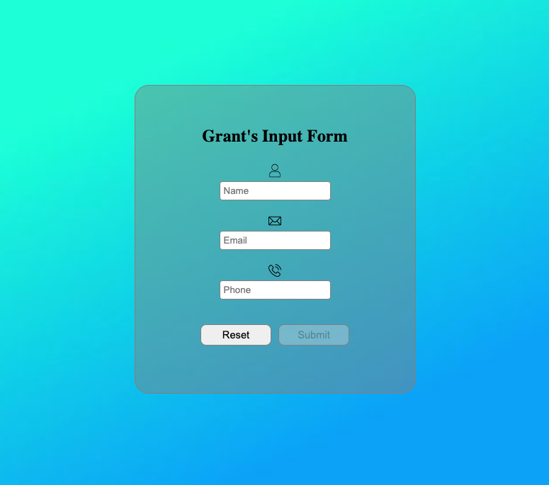

# Simple Input Form
## _A simple, styled input form component built with React_

Simple Input Form is a minimal, reusable input form featuring custom styling and built-in validation. Designed for small apps, portfolios, or component libraries, it's a lightweight solution for capturing user info in a clean interface.

## Live Demo
[Simple Input Form - Live Demo](https://grants-input-form.vercel.app/)

## Screenshot

## Features

- Clean, modern layout with custom styling
- Input fields for Name, Email, and Phone
- Icons for each input using HTML + CSS
- Form reset functionality
- Submit button disables until all fields are valid
- Responsive design

## Tech

This project was built using:

- React
- JavaScript
- CSS

## Acknowledgements

Created as a small front-end component experiment to showcase form layout, style, and validation in React. Easily extendable for more complex use cases.
